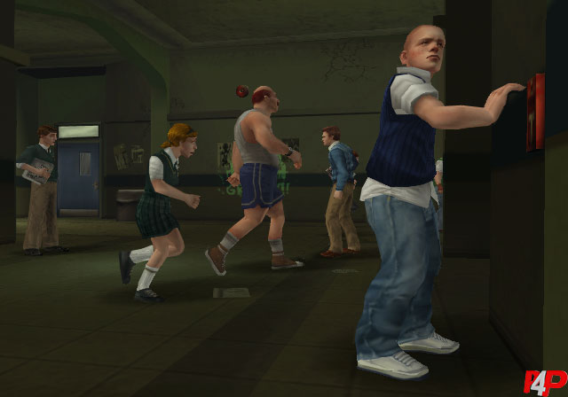
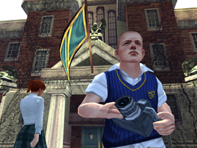
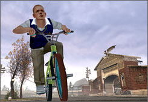
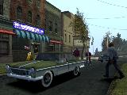
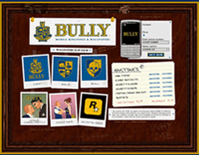

The term "lost media" is thrown around a lot and, from my perspective, often misused. 
"Lost" to me is, as the word suggests, something that was once available but not anymore. On a sentimental value it already is more important than something I never had, and that is without a doubt the main charm of lost media. 
I do not see the word as a substitute for "unreleased" or "cancelled", but since many people do, I'll at the very least discuss unreleased content, thanks to more information being available. 
I'll only discuss ones that I feel are most relevant to **BULLY**, not just related in a broad sense.

## Lost

### 1) Screenshots
One thing I do is try to keep an archive of every pre-release screenshot of the game ever released digitally. You can find it in the Extra Resources section, or [here](../Extras/Screenshots.html). 
Given that the game released {{years-ago:2006-10-27}} years ago and screenshots were sent to various news outlets, over time some of those outlets would eventually and inevitably go offline or go through some significant rebrand involving the removal of past content, leading to a loss of all of its hosted screenshots forever. While some of them are found in multiple sites, quality may vary across each site in regards to resolution, colours, watermarks... 
As time goes on, I will eventually stop finding new screenshots. I might have already updated the collection for the last time, as its last update was (at the time of writing) more than a year ago!
Current best hope is someone happens to have contacts with some news outlets. (I know GamesRadar still has several screenshots buried on their site, just inaccessible)

So then, "lost" screenshots here refer to those screenshots that are NOT available:
- In their original 640x448 resolution.
- Unedited. (Without watermarks or subpar compression)
- Digitally. (Those found in magazines don't count. They'd be subject to resizing and cropping)

Examples:

<figure style="text-align: center; margin: 0;">
    
    
    
    
    <figcaption style="font-size: 0.85em; color: var(--sidebar-text-color); margin-top: 5px;">
        See more screenshots in the All Screenshots page.
    </figcaption>
</figure>

### 2) "Limited Edition" Mobile Ringtones & Wallpapers
On the 12th of December 2006, Rockstar Games added a Bully Mobile Store section to the **BULLY** site, describing it as follows:

<blockquote class="quote" style="font-size: 0.91em">"The Bully Mobile Ringtones & Wallpapers shop is your destination to download from a selection of graphics and tunes that show your school spirit. 
Ringtones are available in polyphonic versions for $1.99 a pop or mastertones for $2.99 and include such ditties as "Fighting Johnny Vincent" and "Vendetta Nerds". 
Wallpapers are $1.99 each and feature a choice of Bullworth crest variations as well as endearing images of your old pals Dr. Crabblesnitch and the ever-humble Mandy.”</blockquote class="quote">

The store is no longer accessible, even through the Wayback Machine, leaving us with only the preview image:

<figure style="text-align: center; margin: 0;">
    
    <figcaption style="font-size: 0.85em; color: var(--sidebar-text-color); margin-top: 5px;">
        A small resolution preview of what the store would have looked like.
    </figcaption>
</figure>

Strangely, the store was removed some time before 2008. 
I could not find any mention hinting at it being available for a limited only, hence why I wrote "Limited Edition" in quotation marks. 
Perhaps it was removed because of the advent of smartphones?

### 3) Leipzig Games Convention 2007 Scholarship Edition Trailer
According to [this article](https://www.gamespot.com/articles/gc-07-bully-scholarship-edition-impressions/1100-6177426/) by GameSpot, Rockstar Games was showing a trailer for **BULLY: Scholarship Edition** at their booth during the Leipzig Games Convention in Germany all the way back in August 2007. Unfortunately, it seems no one recorded it, so who knows what it looked like. This trailer would predate the [official trailer](https://www.youtube.com/watch?v=yqkynwFs9Hs) by four whole months. 
At the very least, judging by the description of the GameSpot article, it's possible the trailer was just an altered version of the second PS2 trailer: ["Everyone at Bullworth Is So Mean"](https://www.youtube.com/watch?v=dHHq1YPaC9g).

## Unreleased

### 1) Comic Strips
With them being in the loading screens, the menu, the concept art, the background decor in various official media, one would think a complete collection of them exists. 
Gather all the ones you can find, however, and this is as far as you'll likely go:

<figure style="text-align: center; margin: 0;">
    
    <figcaption style="font-size: 0.85em; color: var(--sidebar-text-color); margin-top: 5px;">
        Collection of all available comic strips. Compiled by <a href="https://www.youtube.com/@deadpoolXYZ" target="_blank">deadpoolXYZ</a>. 
    </figcaption>
</figure>