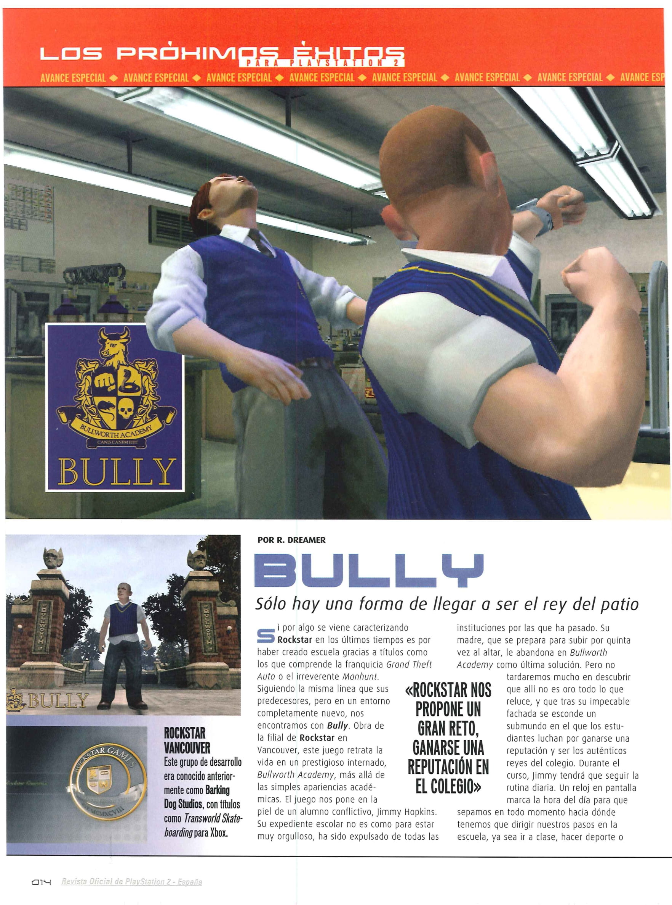
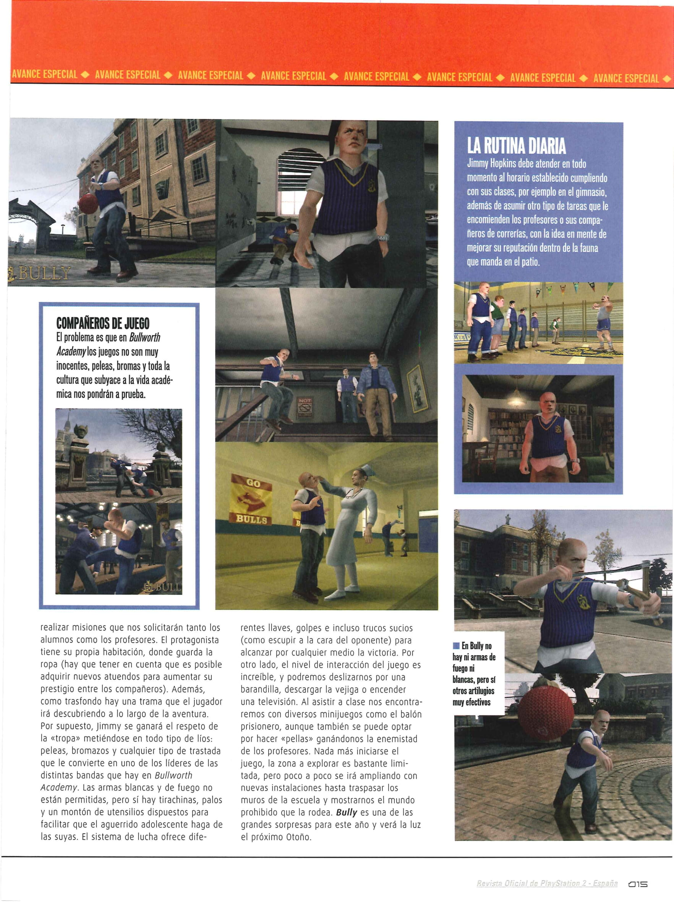
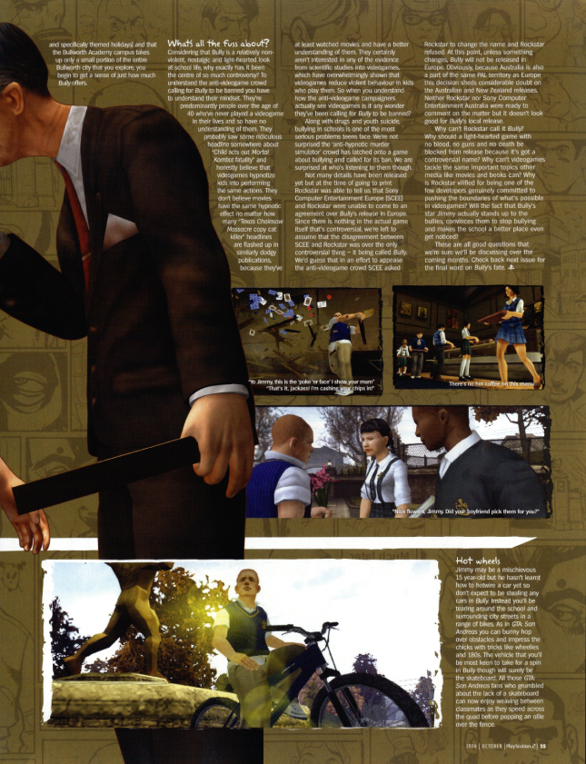

<figure style="float: right; margin: 0 0 10px 20px; max-width: 315px; text-align: center;">
    
    <figcaption style="font-size: 0.85em; color: var(--sidebar-text-color);">
        An official, yet funny-looking 3D render of Jimmy and Dr. Crabblesnitch, from
        <a href="https://www.retromags.com/files/file/5932-psm-issue-116-november-2006/" target="_blank">PSM #116</a>.
    </figcaption>
</figure>

A shame, really. 
Now that we tend to have significantly less pre-release media for modern games, people even complain about having too much. 
Using **GTA VI** as an example, I've seen many being upset for getting a trailer more than a year before release, with the argument being it kills hype in the long-term. 
I could not disagree more. When Ubisoft released the trailer for **Far Cry Primal** out of nowhere with a release date scheduled for some months later and a pre-order option available immediately, I, personally, did not like that approach. It's hard to make a decision when I barely know anything about the game (not that I like pre-orders in the first place).

With the industry becoming more and more secretive, and fans wanting less, I can't help but see cut content as a dying niche. The biggest hints of cut content are now going to be in a game's files once people start digging through them, as opposed to that PLUS pre-release media, which arguably gives much more context.

To be honest, I'm not upset at seeing magazines being phased out. What I'm upset about is not having an alternative for info dump. 
One would think the unlimited digital space would allow for more content, as opposed to less to accomodate for... shorter attention spans, I guess?

Anyway, given that **BULLY** came out in the mid 2000s, a good chunk of news related to it is found in magazines.
Since the game came out on October 2006 and was first announced back in May 2005, it is important to check as many issues of PS2/Xbox magazines from around that period of time, since, thanks to the size of Rockstar Games, it got a lot of coverage. 
It's not uncommon to find plenty of information in them regarding the game's presence at E3, many screenshots that were either never available digitally or have been sadly lost to time, and plenty of wrong information hinting at development changes.

Since looking through a bunch of hundred-page-long magazines takes time, I've been compiling a list of every magazine issue I found even mentioning the word "**BULLY**". 
Okay, maybe not that literally, but the list can be found on my [RetroMags](https://www.retromags.com/profile/39097-simonbestia/?tab=field_core_pfield_34) profile.

I will now proceed to talk about a couple of my favourite findings, starting from my absolute favourite:
## 1) PlayStation 2 Revista Oficial España

With **BULLY** being made in Canada and taking place within New England, I just naturally assumed the game would be mostly popular in North America rather than here in Europe, for example, so logically I first started looking through US magazines, with plenty to choose from, and while there is plenty to be found in those, I would have never guessed that a magazine from Spain would catch my attention the most.

Back in 2022, I came across a video by [Shaztopia](https://www.youtube.com/@Shaztopia1) called [Bully PS2 Rare Merchandise and Game Collecting Deep Dive](https://www.youtube.com/watch?v=6I3V_XiaxtQ). 
The video pointed out how in the [74th issue](https://datassette.org/revistas/playstation-revista-oficial-espana-es-espanha-videogames-revistas/playstation-2-revista-oficial-espana-074) of the *PlayStation 2 Revista Oficial España* there was a contest to win various **BULLY** merch. All one had to do was send a message with the correct answer to the multiple-choice question "*How was the game called in the US?*". Possible answers were: **A)** Bulla, **B)** Bullfight, and **C)** Bully. (It was this silly likely just to drive engagement) 
Since I didn't know about that magazine, I started to look at its other issues to find other mentions of the game.

<figure style="text-align: center; margin: 0;">
    
    
    <figcaption style="font-size: 0.85em; color: var(--sidebar-text-color); margin-top: 5px;">
        Pages 14 and 15.
    </figcaption>
</figure>

Shockingly, pages 14 and 15 of the [55th issue](https://datassette.org/revistas/playstation-revista-oficial-espana-es-espanha-videogames-revistas/playstation-2-revista-oficial-espana-055) featured multiple screenshots that weren't shown in any other US magazine. I, and many others I would assume, only saw some of these for the first time when [SWEGTA](https://www.youtube.com/@SWEGTA) documented the game's [Press Kit](https://www.youtube.com/watch?v=G6VNOZKB__s), yet they had been under our nose the entire time.

I do not know how big this magazine was in Spain, but if it wasn't as much of a big deal as the US counterparts, it begs the question then, were these screenshots just available digitally? If so, if they're now lost media, that's a massive L, and if not, how come it's only this magazine to feature them?

## 2) PlayStation 2 Official Magazine-Australia

This one's a great example for showcasing what to expect when reading these magazines. 
[Issue 58](https://archive.org/details/Official_AUS_Playstation_2_Magazine_Issue_058_2006_10_Derwent_Howard_Publishing_AU) dedicates 4 pages to **BULLY**, and contains screenshots unavailable digitally (seemingly both unreleased and lost ones), inconsistent story details, and made-up names on captions for the sake of entertainment. Be careful not to think of those made-up scenarios as cut content.

<figure style="text-align: center; margin: 0;">
    
    <figcaption style="font-size: 0.85em; color: var(--sidebar-text-color); margin-top: 5px;">
        Page 35.
    </figcaption>
</figure>

Perhaps the most important thing this issue covers, however, is the matter of the game's release in Europe on Page 35. This is the only place where I could find information shared by Rockstar Games about it. The magazine states that "*Rockstar was able to tell us that Sony Computer Entertainment Europe (SCEE) and Rockstar were unable to come to an agreement over Bully's release in Europe.*", and later proceeds to assume it might be related to the name given the game was innocent enough. 
While I have my doubts an entity like Sony would take issues with the name (surely there's worse on the PS2?), I'd be really curious to know what they were disagreeing with at the time.