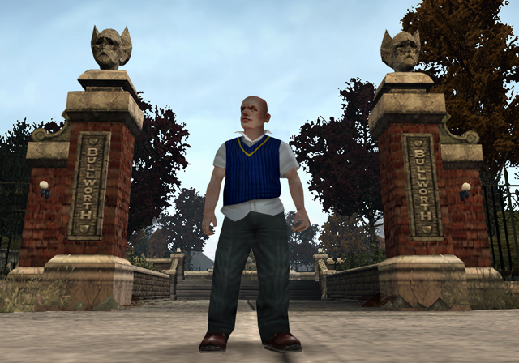

{width=400 float-right}

I've been wanting to make something like this for a while! 
This could be a good spot to write about what I feel isn't worth dedicating an entire video on [YouTube](https://www.youtube.com/@SimonBestia) or is too much of a hassle to write about on [Twitter](https://x.com/SimoBestia), or even just write a post for occasional updates, whether related to this site or not.

Now that [BULLY Scripting Docs](https://bully-scripting.vercel.app) exists, I want to make this site stand out a little more as it overlaps with that one for many things, and probably will with even more as time goes on. 
So, instead of just modding documentation, I might try having some more things documented just for the sake of preservation and ease of access.

One reason this site exists to begin with is because I respect how not everyone likes the idea of a closed space like [Discord](https://discord.com/invite/RcCAE8csCP) for documentation, so it might be nice to have an all-things-**BULLY** site, for everyone to access.

Before this update goes out (as in, by the time you're reading this, hopefully), I'll have prepared some other blog pages for you to read likely focused on topics that aren't brand new but rather that not many people have realised are around or don't seem to be too interested in. Once live, expect future updates at my signature inconsistent-and-irregular rate. ¯\\\_(ツ)\_\/¯